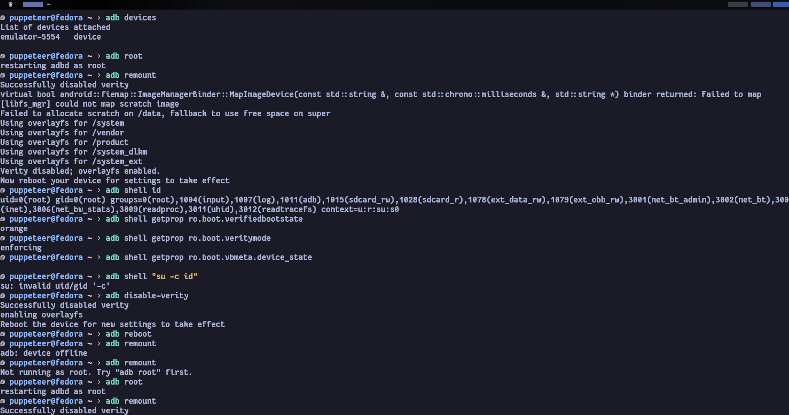
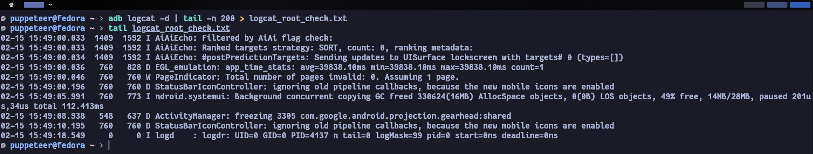
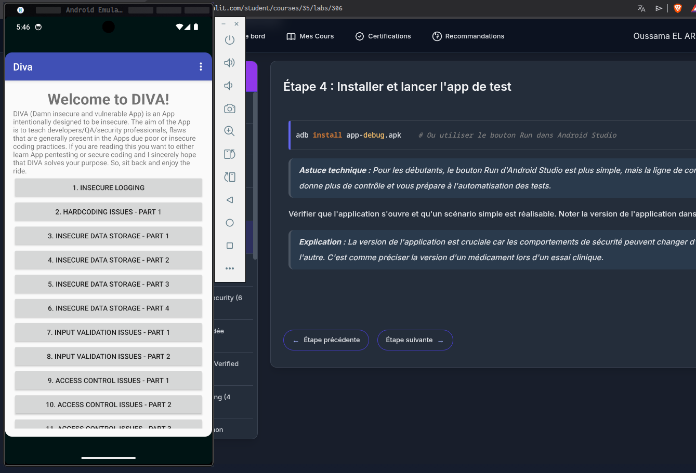
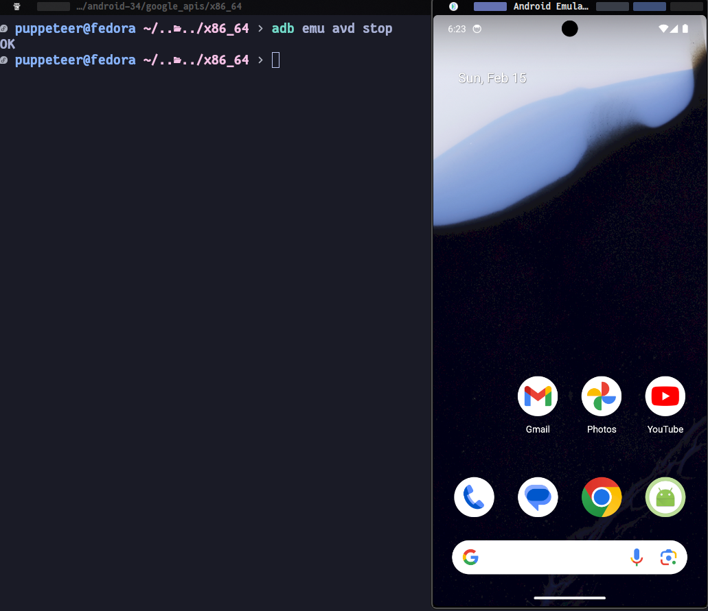

# Introduction :
Ce fichier README.md demontre l'execution des etapes du Lab2

# Etape 1 :
Router l'AVD et la journalisation 

## Etape 1 - 1 :
Essayer a rooter l'AVD :

## Etape 1 - 2 :
La journalisation du system :

# Etape 3 :
L'installation d'une application en utilisant adb install commande :

# Etape 4 :
L'arret de l'emulator android en utilisant la commande adb emu avd stop :

